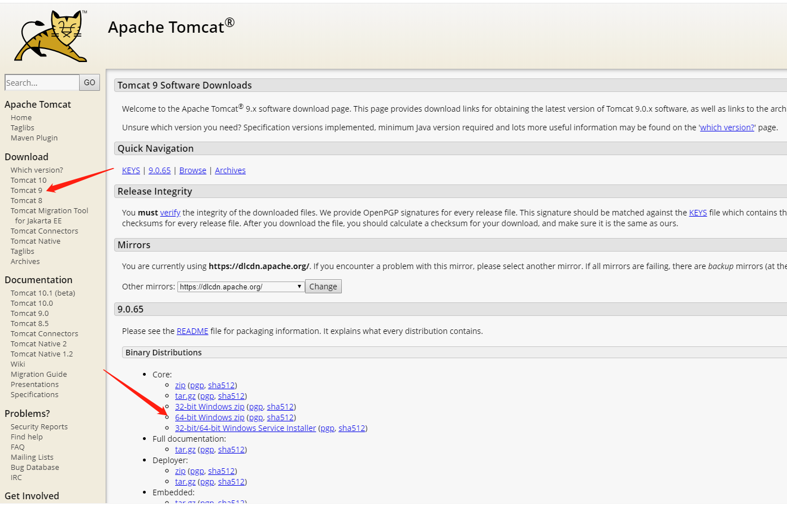
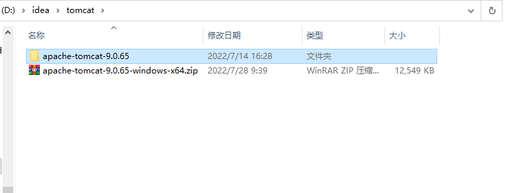
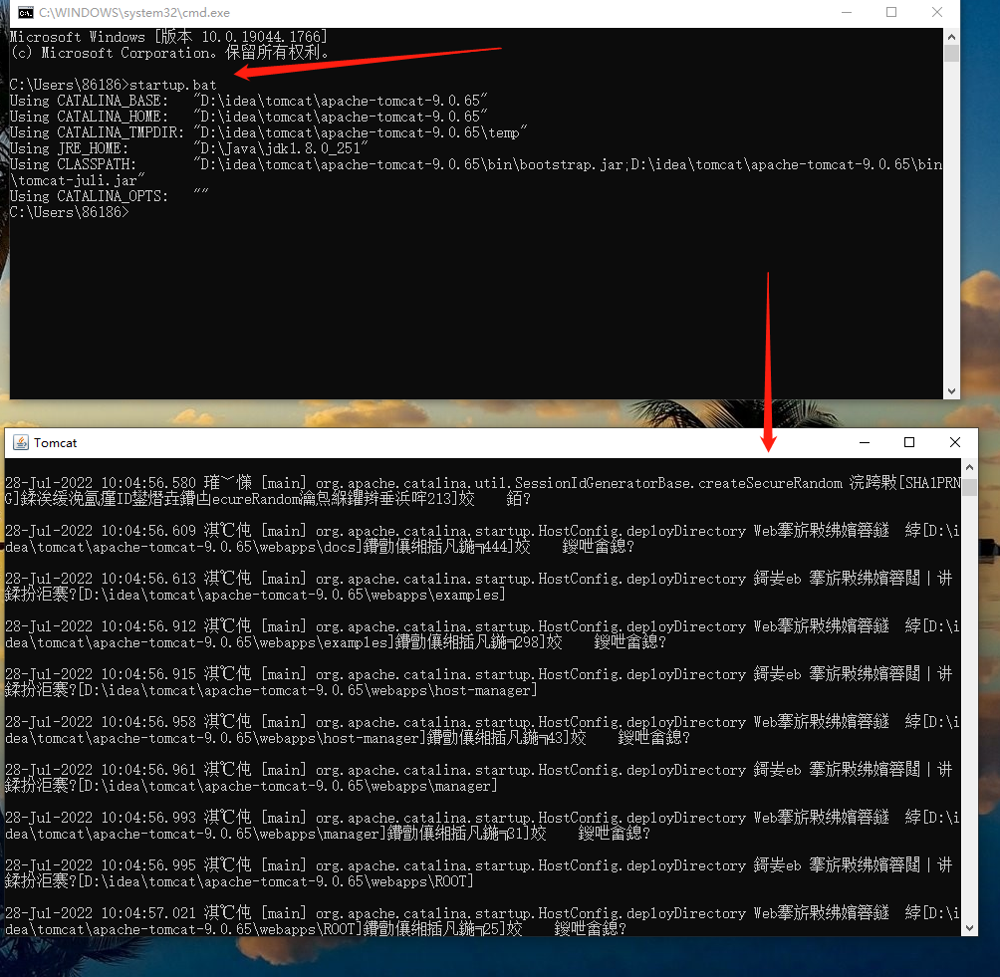
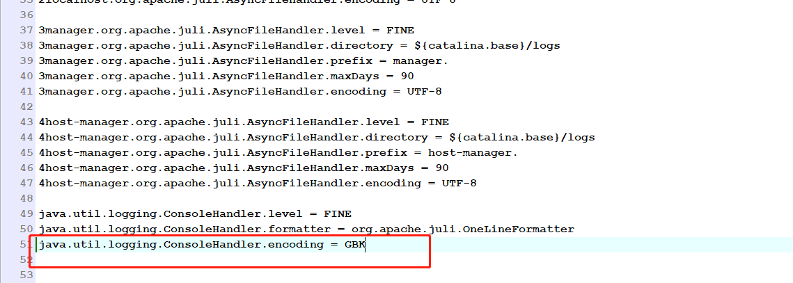

## Tomcat 下载安装及配置

### 1、Tomcat下载

下载tomcat 9，官网地址[https://tomcat.apache.org/](https://tomcat.apache.org/)

点击选择 tomcat 9 进入下载页面，再点击下载 64-Bit Windows zip（Win64）

找到下载的压缩包并解压

    
### 2、Tomcat 配置环境变量

首先在电脑左下角搜索框搜索控制面板并打开。

之后打开系统与安全面板下面的系统菜单。

接着打开高级系统设置弹窗里面的高级-环境变量即可。

新建环境变量，变量名为 TOMCAT_HOME,变量值为 tomcat 解压后所在的路径，点击确定

双击 Path，进入界面后，点击编辑文本

### 3、验证是否配置成功

按win+r 快捷键 打开命令窗口，输入 cmd 指令，点击确定

输入启动指令：

    startup.bat

上图启动 tomcat 后乱码的问题

打开解压后的文件：apache-tomcat-9.0.65->conf->logging.properties

打开 logging.properties，找到代码：

    java.util.logging.ConsoleHandler.encoding = UTF-8

修改为：

    java.util.logging.ConsoleHandler.encoding = GBK

重新启动 tomcat，输入指令 startup.bat，乱码问题得到解决。

验证是否配置成功 

注：上图测试时，下图输入指令 startup.bat 启动的 tomcat 页面不能关闭，否则会报错

tomcat 默认端口号为 8080，若 8080 被占用或者想更换访问端口

编辑文件：apache-tomcat-9.0.65 -> conf -> server.xml

打开 server.xml，找到 Connector 标签所在位置，如下图所示

端口号修改

重新启动 tomcat

测试

